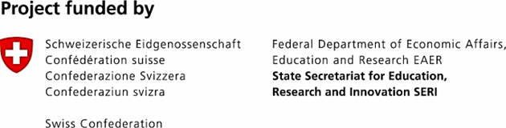

# TEXTaiLES: Digital Tools for Cultural Heritage Textiles

Welcome to the official GitHub organization page for **TEXTaiLES** (TEXTile digitizAtIon tools and mEthodS for cultural heritage), it is a project funded by the European Commission under Grant Agreement n.101158328 and by the Swiss Confederation.

---

## The Project

In this digital age, cultural institutions are confronted with unprecedented challenges regarding sharing and digitising Cultural Heritage (CH) content, as well as collaborating and connecting with one another. To address these issues, the creation of the [European Collaborative Cloud for Cultural Heritage](https://www.echoes-eccch.eu/) (ECCCH) offers a significant chance to encourage CH institutions into widely using collaboration platforms and tools. As a part of the ECCCH, TEXTaiLES employs key emerging technologies like Artificial Intelligence (AI), 3D digitization, Internet of Things (IoT), Cloud/Edge Computing, Robotics, Digital Twins (DTs) to develop a **standardized, cutting-edge technological and methodological ecosystem** for the entire textile digitization lifecycle.

[Project Website](https://textailes-eccch.eu/) | [Project portal](https://textailes.athenarc.gr) 

---

## 🛠️ Core Technologies & Innovation

TEXTaiLES is a highly interdisciplinary project, fusing **computer science, AI, robotics, sensor technologies, and cultural heritage (archeology, conservation)**.

| Technology Area | Core Innovation/Components |
| :--- | :--- |
| **Data Acquisition** | **Robotic Platforms (UAV/UGV):** Custom, safe-by-design, and cost-effective vehicles equipped with multi-sensor arrays (RGB, multispectral, terahertz, lidar) for autonomous and contact-free scanning. **Dynamic Path Planning** adapts the robot movement in real-time to ensure consistent and targeted data collection. |
| **Data Processing & Analysis** | **AI-Empowered Tools:** Algorithms for **surface morphology and microstructure analysis**, **degradation detection/localization**, and **automatic restoration** of damaged parts. **Textile Dynamics and Motion Modeling** simulates how fabrics behave under stretching, shear, bending, torsion, or compression. |
| **Digital Toolkit** | **4D Collaborative Environment:** A web-based 3D viewing, editing, and annotation platform supported by **Digital Twin (DT)** models. The DT tracks alterations over time (4D) and links with real-time sensor data (IoT) for continuous monitoring and predictive preservation. |

---

## Repositories

The following repositories correspond to the core components of the TEXTaiLES echosystem. Detailed documentation for each can be found in the respective dedicated page linked below. This section will be **regularly updated** as the project progresses.

| Repository | Documentation | Focus |
| :--- | :--- | :--- |
| [**AmalthAI**](https://github.com/TEXTaiLES/AmalthAI) | [Documentation](https://textailes.github.io/AmalthAI-documentation) | End-to-end ML platform |
| [**THOTH**](https://github.com/TEXTaiLES/THOTH) | [Documentation](https://textailes.github.io/thoth-documentation) | 3D Viewer and Annotator |
| [**ZEUSbot**](https://github.com/TEXTaiLES/ZEUSbot) | [Documentation](https://textailes.github.io/UGV-documentation) | Uncrewed Ground Vehicle (UGV) Platform |
| [**NEFELE**](https://github.com/TEXTaiLES/SAMplify_SuGaR) | [Documentation](https://textailes.github.io/SAMplify_SuGaR-documentation) | 3D Reconstruction based on Gaussian Splatting |
| [**HESTIA**](https://github.com/TEXTaiLES/HESTIA) | [API docs](http://textailes.athenarc.gr:5000/docs) | Data Lake (main data repository) |

---

## Publications
Below you can find a list of scientific publications, presentations, and dissemination materials produced within **TEXTaiLES**. This section will be **regularly updated** as the project progresses.

### 🗓️ 2025
Sidiroglou, E. C., Kapoutsis, A. C., An, S., & Tsintotas, K. A. (2025, September). Design and Implementation of a Modular Omnidirectional Ground Robot Using Raspberry Pi 5 and ROS 2. In 2025 European Conference on Mobile Robots (ECMR) (pp. 1-6). IEEE.
---

## Open Source principles
TEXTaiLES is committed to an inherent open-source culture. We build on **open standards and specifications** and utilize the container ecosystem (Docker, K8s) for flexible and transparent software component deployment.

## Getting Involved

We welcome engagement from the cultural heritage, scientific, and technical communities.

---

## 🏛️ Funded by

<picture align="left">
  <source media="(prefers-color-scheme: dark)" srcset="EN_FundedbytheEU_RGB_NEG-1536x342.png">
  <source media="(prefers-color-scheme: light)" srcset="EN_FundedbytheEU_RGB_POS-1536x342.png">
  
</picture>
<picture align="left">
  <source media="(prefers-color-scheme: dark)" srcset="WBF_SBFI_EU_Frameworkprogramme_E_RGB_neg_hoch.png">
  <source media="(prefers-color-scheme: light)" srcset="WBF_SBFI_EU_Frameworkprogramme_E_RGB_pos_hoch.png">
  
</picture>
